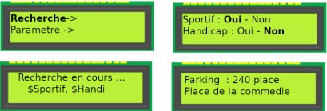
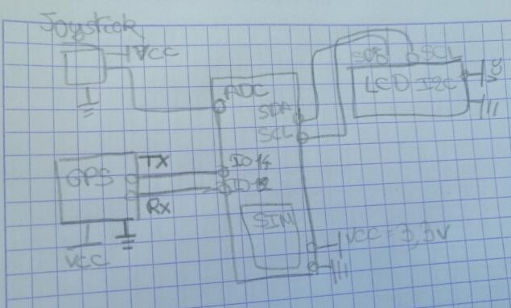
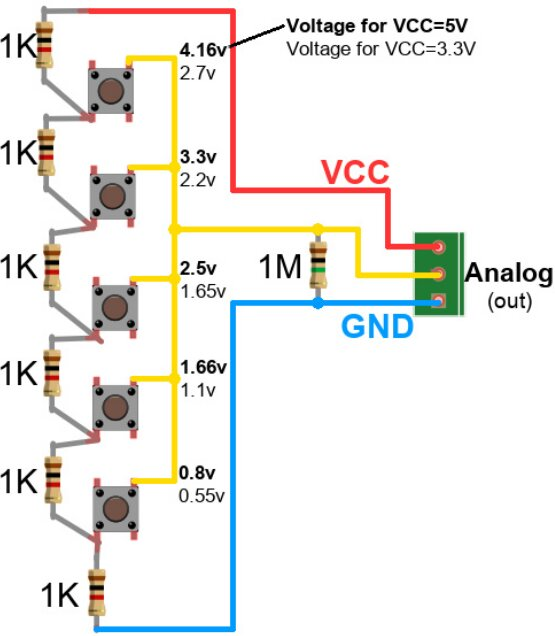

---
author:
- Nicolas Vadkerti
title: TP APPIDO
---

<https://github.com/SlaynPool/CR_APPIDO/>

Sujet
=====

Développer un objet connecté d'aide au stationnement dans les parkings
de Montpellier

Décrire le fonctionnement global du dispositif
==============================================

Notre objectif dans ce projet va etre "simple". Nous allons devoir
dévelloper un objet qui devra indiquer aux Montpelliérains qui
l'utiliserons où ils peuvent se stationner. L'objet devra donc
communiquer avec du coté utilisateur, pour pouvoir lui indiquer le
parking le plus proche, mais il devra aussi communiquer avec des
serveurs qui auront pour but de lui indiquer les places disponibles.
Pour l'utilisateur, on peut imaginer un ecran LCD ainsi qu'un joystick 5
boutons pour interagir avec le système et ainsi, definir les preferences
de recherche de l'utilisateur, et evidement lancer la recherche du
parking le plus approprié.\
L'objet devra aussi interagir avec differentes infrastructures
informatiques afin d'etre capable de ce repérer dans la ville, ainsi que
de connaitre les capacités des parkings. Pour le premier élément, nous
utiliserons une puce gps, qui sont devenue largement grand public et peu
chère. Pour le second, nous utiliserons les data disponibles via
<https://data.montpellier3m.fr/>. Il nous faudra donc une puce 3G/4G
pour faire des requetes sur le site de la ville via internet.\
On pourrai imaginer l'interface utilisateur comme ceci :\

{#fig:universe width="90%"}

Déterminer l'aspect matériel du dispositif
==========================================

Pour un tel objet, nous pouvons facilement imaginer que nous allons
l'utiliser dans notre voiture, et donc qu'un alume-cigare voir un port
USB pourra faire office d'alimentation. Comme nous allons utiliser un
ESP32 pour notre microcontroleur, nous nous efforcerons de trouvé des
modules GPS, ainsi que des modules 4G avec des bibliothèques existantes.
Le GPS que nous utiliserons sera le REYAX RY8253F qui s'utilise
facilement via un port serie. Pour la puce 4G, des shields pour arduino
existe donc supposera que nous pourrons utilser la connectivité de la
meme maniere que pour la puce Wifi de l'ESP32.\
Pour la partie Interface utilisateur, nous utiliserons un ecran LCD 16x2
et 5 boutons pour faire notre "joystick" Le montage resemblerait à celui
ci :\

{#fig:universe width="90%"}

\
Pour ce qui est du joystick, on pourrait utilisé un montage comme celui
ci, pour avoir : droite gauche, haut bas et le clique:\

{#fig:universe width="50%"}

Décrire de manière globale le fonctionnement logiciel
=====================================================

Voici comment le logiciel fonctionnera :

-   ``` {#code/pseudocode caption="pseudocode" label="code/pseudocode" style="Style1"}
    void recherche(){
        on affiche "Recherche en Cours ...";
        on obtient notre position GPS;
        determiner les 3 parkings les plus proche;
        on interroge la place dans les 3 parkings les plus proches;
        
        si on a parametre Handicape{
            
            choisir le plus proche;
        }
        si on a parametre Sportif{
            si tous les parkings on moins de 50 places dispo{
                choisir le moins plein;
            }
        }
        while(true){
        si click est presse{
            appelle Menu();
        }
        afficher" Parking : ....";
        }
    }

    void parametre(){
    while(true){
        afficher les parametres;
        if "Click" est presse{
            appelle Menu();
        }   
        si on est sur Sportif{
            si pression droite{
                Sportif= Non;
                mettre en gras Non;
            }
            si pression gauche{
                Sportif = Oui;
                mettre en gras Oui;

            }

        }
        si on est sur handicap{
            si pression droite{
                Handicap= Non;
                mettre en gras Non;
            }
            si pression gauche{
                handicap = Oui;
                mettre en gras Oui;

            }


        }
    }
    }
    void Menu(){
            affiche le menu;
            si on presse haut{
                etre sur Recherche
                afficher Recherche en gras
            }
            si on presse bas{
                etre sur parametre
                afficher parametre en gras
            }   
            si on est sur "Recherche ->" et que l'on "Click"{
                
                On appelle recherche();
            }
            si on est sur "parametre -> " et que l'on "Click"{
                
                On appelle parametre();
            }
    }
    void setup(){
        initialisation du GPS;
        initialisation de l'Ecran LCD;
        initialisation de la puce 4G;
        initialisation du CAN pour le joystick;
        Menu();

    }
    void loop(){}
    ```

 Implémenter une solution en considérant que les coordonées GPS sont disponibles (fictives)
==========================================================================================

-   ``` {#code/code.ino .c++ caption="code" label="code/code.ino" style="Style1"}
    #include <HTTPClient.h>
    #include <tinyxml2.h>
    #include <math.h>
    #include <TinyGPS++.h>
    #include <SoftwareSerial.h>

    static const int RXPin = 4, TXPin = 3;
    static const uint32_t GPSBaud = 115200;

    // The TinyGPS++ object
    TinyGPSPlus gps;

    // The serial connection to the GPS device
    SoftwareSerial ss(RXPin, TXPin);
    using namespace tinyxml2;
    const int Joy = A0; 
    int sportif= 1; //non
    int handi= 1; //non
    #define BTN_NONE   0
    #define BTN_CLICK  1
    #define BTN_UP     2
    #define BTN_DOWN   3
    #define BTN_LEFT   4
    #define BTN_RIGHT  5

    void afficheError(){

    }
    void afficheLoading(){

    }
    void afficheResult(){

    }
    void afficheParametre(){
    }
    void afficheMenu(){

    }
    void mypos(float *lon, float *lat){
        if (ss.available() > 0){
            gps.encode(ss.read());
        if (gps.location.isUpdated()){
          lat = gps.location.lat();
          lon = gps.location.lng();
        }


    }


    void dispo(int *disp, char park){
        HTTPClient http;

        http.begin("https://data.montpellier3m.fr/sites/default/files/ressources/"+park+".xml"); //Specify the URL
        int httpCode = http.GET();
        if (httpCode > 0) { //Check for the returning code
            String payload = http.getString();
            XMLDocument xmlDocument;
            if(xmlDocument.Parse(payload)!= XML_SUCCESS){
                afficheError();
                menu();
            }
            XMLNode * park = xmlDocument.FirstChild();
            XMLElement * freeP = park->FirstChildElement("Free");
            freeP->QueryIntText(disp);
        }    
    }

    void parkingProche( char *P1, char *P2, char *P3, float lon, float lat){
        float corum[2]= 43.6144154,3.8793361;
        float come[2]= 43.6087024,3.8781513;
        float gare[2]= 43.6027102,3.8742258;
        //SA-B = arc cos (sin latA sin latB + cos latA cos latB cos (lonA-lonb)
        float moiCorum, moiCom,moiGare;
        moiCorum= arc(cos(sin(lat)*sin(corum[0])+cos(lat)*cos(corum[0])*cos(lon-corum[1])));
        moiCom= arc(cos(sin(lat)*sin(come[0])+cos(lat)*cos(come[0])*cos(lon-come[1])));
        moigare= arc(cos(sin(lat)*sin(gare[0])+cos(lat)*cos(gare[0])*cos(lon-gare[1])));
        if (moiCorum < moiCom){ // JE TRAITRE PAS TOUS LES CAS mais c'est pour l'idee
            if (moiCorum < moigare){
                P1= moiCorum;
                if (moiCom<moigare){
                    P2= moiCom;
                    P3= moigare;
                }}}
        if (moicom < moigare){
            P1= moiCom;
            if(moiCorum < moigare){
                P2= moiCorum;
                P3=moigare;
                }
        }
        else{
            P1= moigare;
            P2= moiCorum;
            P3= moiCom
        }

         
        
    }


    void recherche(){
        afficheLoading();
        float lon, lat;
        mypos(&lon, &lat);
        char P1, P2, P3;
        parkingProche(&P1, &P2, &P3, lon, lat);
        int p1dispo, p2dispo, p3dispo;
        dispo(&p1dispo,P1);
        dispo(&p2dispo,P2);
        dispo(&p3dispo,P3);
        if(handi==0){
            if( p1dispo!= 0){
                afficheResult(P1, p1dispo);
            }
            else if( p2dispo!=0){
                afficheResult(P2, p2dispo);
            }
            else if( p3dispo!=0){
                afficheResult(P3, p3dispo);
            }
        }
        if(sportif==0){
            if(p1dispo>50){
                afficheResult(P1, p1dispo);
            }
            else{
                if( p2dispo<50){
                    if(p3dispo<50){
                        if( p1dispo>p2dispo){
                            if (p1dispo>p3dispo){
                                afficheResult(P1, p1dispo);
                            }
                        }else if( p2dispo>p3dispo){
                                afficheResult(P2, p2dispo);
                        }else{
                            afficheResult(P3, p3dispo);
                        }
                    }
            }

        }


    }


    void parametre(){
        select=0;
        afficheParametre(select);    
    while(1){
        byte btn;
        btn = readJoy();
        if( btn == BTN_UP )
           select=0;
           afficheParametre(select);
        else if( btn == BTN_DOWN ){
           select=0;
           afficheParametre(select);
        }
        else if( btn == BTN_RIGHT ){
           if (select==0){
                sportif=1;
           }
           if (select==1){
                handi=1;
           }
           afficheParametre(select);
        }
        else if( btn == BTN_LEFT ){
           if (select==0){
                sportif=0;
           }
           if (select==1){
                handi=0;
           }
           afficheParametre(select);
        }

        else if( btn == BTN_CLICK )
            menu();
    }


    }
    void menu(){
        select=0;
        afficheMenu(select);

    while(1){
        byte btn;
        btn = readJoy();
        if( btn == BTN_UP ){
            select=0;
            afficheMenu( select);
        }
        else if( btn == BTN_DOWN ){
            select=1;
            afficheMenu( select);
        }
        else if( btn == BTN_CLICK ){
            if(select==0){
                recherche();
            }
            else if(select==1){
                parametre();
             }
        }

    }
    }

    byte readJoy(){
      int buttonValue = 0; 
      buttonValue = analogRead(Joy );
      Serial.println( buttonValue );
      if( buttonValue > 760 ) {
        return BTN_CLICK; }
      else if( buttonValue > 580 ) {
        return BTN_RIGHT; }
      else if( buttonValue > 400 ) {
        return BTN_UP; }
      else if( buttonValue > 220 ) {
        return BTN_LEFT;}
      else if( buttonValue > 100 ) {
        return BTN_DOWN; }
      else {
        return BTN_NONE;
      }
    }
    }
    void initLCD();
    void initSIM(){
    // On suppose que ca marche
    }
    void initGPS(){
        ss.begin(GPSBaud);
    }
    void initLCD();
    void setup(){
        initGPS();
        initSIM();
        initLCD();
        menu();
    }
    void loop(){}
    ```

Je n'est pas Implémenter les affichages LCD par manque de temps
